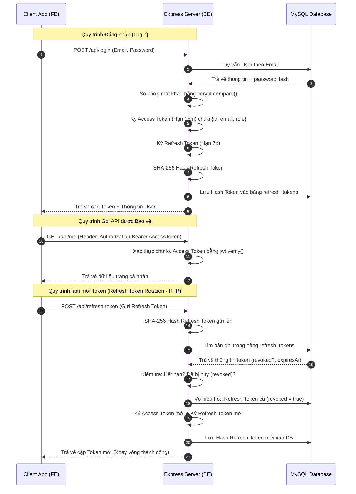
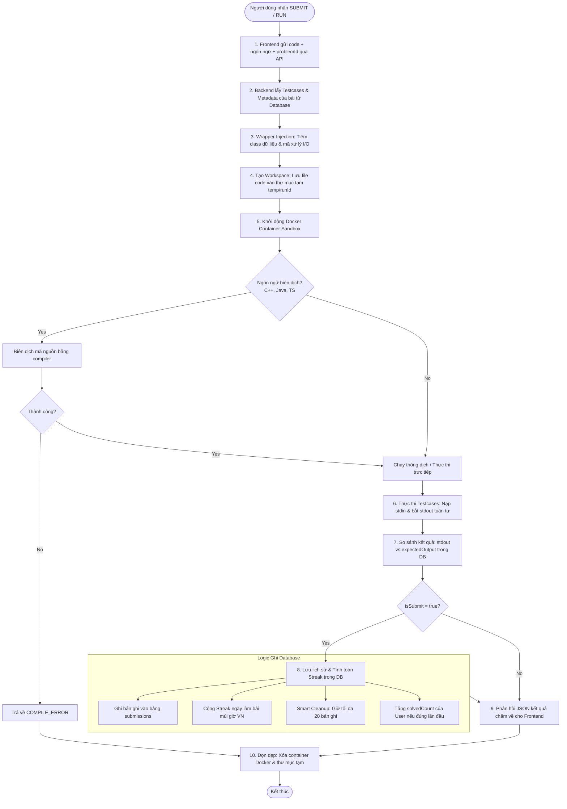

# 📖 HƯỚNG DẪN KIẾN TRÚC & QUY TRÌNH KỸ THUẬT (README 3)

Tài liệu này đi sâu vào giải thích các quyết định kiến trúc, quy trình xử lý kỹ thuật cốt lõi và lý do lựa chọn công nghệ cho hệ thống LeetCode Clone.

---

## 🔑 1. Cơ chế Xác thực & Quản lý JWT Token

Hệ thống áp dụng cơ chế xác thực dựa trên token (**Token-Based Authentication**) sử dụng cặp **Access Token** và **Refresh Token** để bảo vệ API và tối ưu hóa trải nghiệm người dùng.

### 1.1 Luồng Đăng ký & Đăng nhập
*   **Đăng ký (`POST /api/register`)**:
    1. Tiếp nhận `username`, `email` và `password`.
    2. Kiểm tra tính duy nhất của Username và Email trong MySQL DB. Nếu bị trùng, ném ra lỗi `409 Conflict`.
    3. Sử dụng thư viện `bcryptjs` băm mật khẩu với **10 Salt Rounds** để tạo ra `passwordHash` an toàn.
    4. Ghi nhận User mới vào MySQL, đồng thời tự động ký Access Token trả về để người dùng đăng nhập ngay lập tức.
*   **Đăng nhập (`POST /api/login`)**:
    1. Tìm kiếm thông tin người dùng trong DB bằng Email.
    2. So sánh mật khẩu người dùng nhập với `passwordHash` đã lưu bằng hàm `bcrypt.compare()`.
    3. Nếu khớp, tạo và ký bộ đôi Access Token (hạn 15 phút) và Refresh Token (hạn 7 ngày).

### 1.2 Cơ chế Xoay vòng Token (Refresh Token Rotation - RTR)
Để hạn chế tối đa nguy cơ bị đánh cắp Refresh Token, hệ thống áp dụng cơ chế **Refresh Token Rotation**:
*   Khi Access Token hết hạn (sau 15 phút), Client gửi Refresh Token lên endpoint `/api/refresh-token`.
*   Server băm chuỗi token này bằng thuật toán SHA-256 và đối chiếu bản ghi lưu trong bảng `refresh_tokens`.
*   Nếu token hợp lệ, chưa hết hạn, và chưa bị vô hiệu hóa (`revoked: false`):
    1. Server lập tức vô hiệu hóa Refresh Token hiện tại (`revoked` chuyển thành `true` hoặc bị xóa).
    2. Sinh ra một Access Token mới và một Refresh Token hoàn toàn mới.
    3. Băm và lưu Refresh Token mới vào database.
    4. Trả bộ đôi token mới về cho Client.
*   **Chống tấn công phát lại (Replay Attack)**: Nếu kẻ gian trộm được Refresh Token cũ và cố tình gửi lại, hệ thống sẽ phát hiện token này đã ở trạng thái `revoked: true` và lập tức từ chối yêu cầu, bắt buộc người dùng đăng nhập lại từ đầu để bảo mật.

### 1.3 Cơ chế Đăng xuất (`POST /api/logout`)
*   Khi người dùng bấm đăng xuất, Client gửi yêu cầu kèm Access Token.
*   Server thực hiện vô hiệu hóa toàn bộ (`revokeAllRefreshTokens`) các bản ghi Refresh Token của người dùng đó trong bảng `refresh_tokens` bằng cách chuyển trạng thái `revoked = true`.
*   Mọi yêu cầu làm mới token bằng bất kỳ token cũ nào sau đó đều bị chặn hoàn toàn.

---

## 🐳 2. Cơ chế Thiết lập Docker Sandbox để Chấm Code

Docker đóng vai trò là "máy ảo cô lập siêu nhẹ" phục vụ biên dịch và thực thi mã nguồn do người dùng nộp lên mà không gây ảnh hưởng đến hệ điều hành chủ (Host OS).

### 2.1 Các Dockerfile chuyên dụng cho từng ngôn ngữ
Hệ thống xây dựng các Dockerfile tối giản hóa để khởi chạy mã nguồn nhanh nhất:
1.  **C++ (`Dockerfile.cpp`)**: Sử dụng ảnh gốc `gcc:latest`. Cài đặt thêm thư viện `nlohmann/json` (ở dạng file header đơn lẻ `json.hpp`) giúp C++ dễ dàng đọc dữ liệu JSON từ các testcase đầu vào.
2.  **Java (`Dockerfile.java`)**: Sử dụng ảnh gốc `eclipse-temurin:17-jdk-alpine` gọn nhẹ. Tải sẵn thư viện `gson.jar` và đặt vào thư mục `/opt/gson.jar` để phục vụ chuyển đổi định dạng JSON của dữ liệu testcase.
3.  **TypeScript (`Dockerfile.ts`)**: Sử dụng ảnh gốc `node:18-alpine`. Cài đặt trình biên dịch TypeScript (`typescript` compiler toàn cục) để biên dịch mã nguồn `.ts` thành `.js` trước khi thực thi bằng Node.js.
4.  **Python & JavaScript**: Sử dụng trực tiếp các ảnh tối giản gốc từ Docker Hub (`python:3.9-slim` và `node:18-alpine`) mà không cần build lại vì đây là các ngôn ngữ thông dịch trực tiếp.

### 2.2 Các tham số giới hạn tài nguyên của Container
Khi chạy lệnh khởi tạo Docker Container để chấm bài, Node.js spawn command với các tham số bảo vệ nghiêm ngặt:
*   `--memory=256m`: Giới hạn dung lượng RAM tối đa là **256 Megabytes**. Nếu người dùng viết code đệ quy vô hạn hoặc khai báo mảng quá lớn, container sẽ bị crash lập tức mà không gây tràn bộ nhớ RAM của Server Host.
*   `--network=none`: Vô hiệu hóa hoàn toàn card mạng bên trong container. Người dùng không thể viết code thực hiện tải mã độc về container hoặc thực hiện các cuộc tấn công mạng ra ngoài.
*   `--rm`: Tự động xóa sạch Container (file logs, tài nguyên sử dụng) ngay sau khi tiến trình chạy code kết thúc.
*   `-v ${runDir}:/app`: Chỉ ánh xạ (mount) thư mục tạm chứa mã nguồn của bài đó vào container. Container không có quyền truy cập vào bất cứ thư mục hệ thống nào khác trên máy chủ.
*   `timeout`: Server đặt bộ đếm thời gian tối đa **2 giây** đối với các ngôn ngữ thông dịch và tối đa **60 giây** đối với bước biên dịch C++/Java. Vượt quá thời gian này, tiến trình Docker sẽ bị ngắt (kill) cưỡng bức để chống treo máy do lỗi vòng lặp vô hạn (`while(true)`).

---

## 📊 3. Tại sao chọn MySQL thay vì SQL Server (MSSQL)?

| Tiêu chí so sánh | MySQL (Được chọn) | SQL Server (MSSQL) | Lý do MySQL phù hợp hơn cho dự án |
| :--- | :--- | :--- | :--- |
| **Bản quyền & Chi phí** | **Miễn phí hoàn toàn** (Mã nguồn mở GPL). | Đắt đỏ (Yêu cầu phí bản quyền theo nhân CPU cho doanh nghiệp). | Dự án mã nguồn mở / học tập tối ưu hóa chi phí vận hành ở mức 0 đồng. |
| **Tiêu thụ tài nguyên** | **Cực kỳ nhẹ**. Chỉ mất khoảng 50MB - 100MB RAM khi khởi chạy. | Nặng nề. Thường ngốn từ 1GB - 2GB RAM tối thiểu để hoạt động ổn định. | Thích hợp chạy trên các máy ảo Cloud VPS cấu hình thấp (1 vCPU, 1GB RAM) hoặc máy cá nhân của học viên. |
| **Tương thích hệ điều hành** | Hoạt động hoàn hảo trên mọi nền tảng, đặc biệt là **Linux** (Hệ điều hành server phổ biến nhất). | Tối ưu tốt nhất trên Windows Server. Bản chạy trên Linux/Docker nặng và nhiều hạn chế. | Giúp việc chạy Docker hóa toàn bộ dự án trở nên đồng bộ, gọn nhẹ. |
| **Cộng đồng Node.js** | Hệ sinh thái thư viện kết nối cực kỳ chín muồi, ổn định và tài liệu dồi dào. | Phù hợp nhất với hệ sinh thái .NET / C# của Microsoft. | Đảm bảo tính ổn định và tốc độ kết nối khi code backend bằng Javascript. |

---

## 🛠️ 4. Tại sao chọn Prisma ORM thay vì viết SQL thuần (Raw SQL)?

Dù viết SQL thuần mang lại hiệu năng tối đa trên lý thuyết, **Prisma ORM** được lựa chọn vì mang lại những lợi ích vượt trội về hiệu suất phát triển và tính an toàn của dự án:

1.  **Type Safety (An toàn kiểu dữ liệu) tuyệt đối**:
    *   Prisma tự động đọc file `schema.prisma` và sinh ra mã TypeScript/JavaScript Client tương ứng.
    *   Khi viết code, IDE (như VS Code) sẽ tự động gợi ý chính xác tên bảng, tên cột, kiểu dữ liệu (Auto-completion). Lỗi gõ sai tên trường (ví dụ: gõ nhầm `user_id` thành `userId` trong câu lệnh SQL) được triệt tiêu hoàn toàn ngay khi viết code.
2.  **Cơ chế Migration tự động & Studio trực quan**:
    *   Thay vì phải viết các câu lệnh SQL tạo bảng (`CREATE TABLE...`), sửa bảng (`ALTER TABLE...`) bằng tay dễ sai sót, nhà phát triển chỉ cần cập nhật cấu trúc bảng trong file `schema.prisma` và chạy lệnh `npx prisma migrate dev`. Prisma sẽ tự động so sánh sự khác biệt và thực thi mã SQL migration một cách chuẩn xác.
    *   **Prisma Studio** cung cấp giao diện Web UI trực quan để xem, sửa đổi nhanh dữ liệu mà không cần phần mềm bên thứ 3.
3.  **Bảo mật chống tấn công SQL Injection**:
    *   Với SQL thuần, lập trình viên nếu sơ suất nối chuỗi truy vấn (ví dụ: `SELECT * FROM users WHERE email = '` + email + `'`) sẽ mở ra lỗ hổng SQL Injection.
    *   Prisma Client tự động tham số hóa mọi câu lệnh truy vấn gửi xuống MySQL, giúp ứng dụng miễn nhiễm hoàn toàn với các cuộc tấn công SQL Injection một cách mặc định.
4.  **Tăng tốc độ phát triển dự án (Developer Experience - DX)**:
    *   Prisma tự động hóa các thao tác JOIN phức tạp thông qua tham số `include` (ví dụ: lấy bài viết thảo luận kèm thông tin avatar của tác giả và danh sách bình luận bên dưới).
    *   Hỗ trợ cơ chế Giao dịch an toàn (`prisma.$transaction`) để thực thi nhiều câu lệnh đồng thời (như lưu lịch sử nộp bài ➔ tính streak ➔ tăng bộ đếm bài giải của User) đảm bảo tính toàn vẹn dữ liệu (ACID) mà không cần viết các câu lệnh commit/rollback SQL phức tạp.

---

## 🏃 5. Quy trình chi tiết của Tính năng Chạy Code (Code Runner Flow)

Khi một lập trình viên nhấn nút **Submit** (hoặc **Run Code**), hệ thống sẽ trải qua các bước xử lý tuần tự dưới đây:

### Chi tiết bước 3: Wrapper Injection (Tiêm mã nguồn bổ trợ)
Để người dùng chỉ cần tập trung viết logic giải bài (như viết lớp `Solution` và phương thức giải), hệ thống sẽ bao bọc mã của người dùng trong một cấu trúc chương trình chạy hoàn chỉnh trước khi chuyển xuống Docker:
*   **Với Python**: Nối mã nguồn cấu trúc danh sách liên kết `ListNode` lên trên, sau đó nối thêm hàm `_run_wrapper()` ở dưới cùng. Hàm này dùng thư viện `sys.stdin.read()` đọc toàn bộ testcase đầu vào từ file cấu hình, chuyển đổi chuỗi JSON thành mảng Python, gọi phương thức của lớp `Solution`, sau đó in kết quả ra màn hình dưới dạng JSON.
*   **Với C++**: Tiêm thư viện `json.hpp` và cấu trúc struct `ListNode`. Hàm `main` sử dụng vòng lặp `while(getline(cin, line))` đọc dữ liệu từ stdin, sử dụng regex loại bỏ tên biến đầu vào (như biến đổi `nums = [2,7,11]` thành `[2,7,11]`), parse thành kiểu dữ liệu C++, gọi hàm xử lý, và in output ra stdout.
