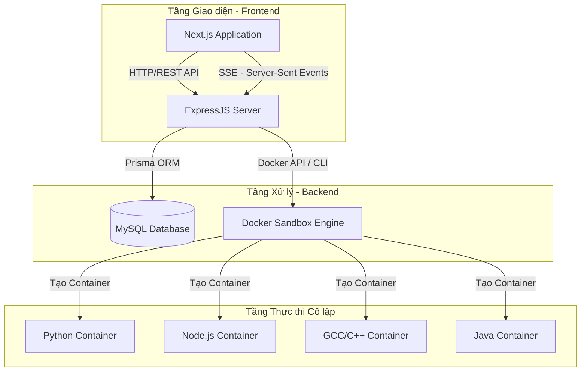
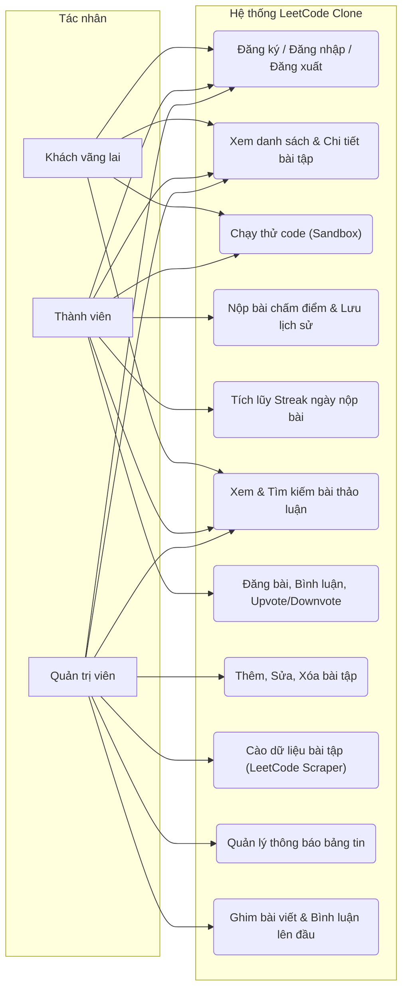
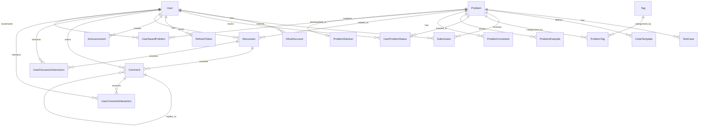
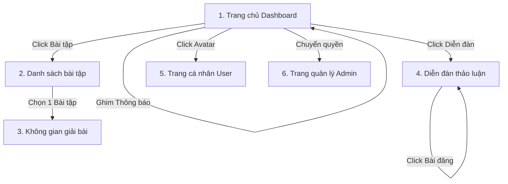

# CHƯƠNG 2. PHÂN TÍCH VÀ THIẾT KẾ HỆ THỐNG

## 2.1 Kiến trúc tổng thể hệ thống

Hệ thống LeetCode Clone được thiết kế theo mô hình **Client - Server** kết hợp với kiến trúc **Sandbox Execution** (Môi trường thực thi cô lập bằng Docker) để phục vụ cho việc biên dịch và chạy code của người dùng một cách an toàn và tối ưu hiệu năng.



### 2.1.1 Kiến trúc Tầng Backend (Clean Architecture)
Backend của hệ thống được tổ chức theo cấu trúc **Clean Architecture** chia nhỏ thành các tầng trách nhiệm độc lập giúp dễ dàng bảo trì và mở rộng:

1. **Routes (Tầng định tuyến - Cửa ra vào)**: Định nghĩa các đường dẫn API và gắn các Middleware kiểm tra bảo mật (như JWT Authentication, Quyền hạn vai trò).
2. **Controllers (Tầng tiếp nhận - Lễ tân)**: Tiếp nhận các yêu cầu (HTTP Request) từ phía Client, bóc tách các tham số cần thiết (`req.body`, `req.params`, `req.query`), gọi các Service xử lý nghiệp vụ tương ứng và trả về phản hồi (HTTP Response/JSON) cho Client.
3. **Services (Tầng logic nghiệp vụ - Quản lý)**: Thực hiện kiểm tra tính toàn vẹn của dữ liệu, phân quyền nâng cao và thực hiện các nghiệp vụ tính toán logic chính (như thuật toán tính Streak nộp bài, phân tách cấu trúc dữ liệu chung).
4. **Repositories (Tầng truy xuất Database - Thủ kho)**: Tầng duy nhất được phép tương tác trực tiếp với cơ sở dữ liệu thông qua Prisma ORM. Trừu tượng hóa các câu lệnh SQL/Prisma giúp Tầng Service độc lập hoàn toàn với việc lưu trữ thực tế.
5. **Container (Dependency Injection)**: Đóng vai trò là "ổ điện trung tâm" quản lý vòng đời và kết nối các thành phần (Services, Controllers, Repositories) với nhau để giảm sự phụ thuộc cứng (tight coupling).

### 2.1.2 Kiến trúc Docker Code Runner Sandbox (Môi trường chấm bài cô lập)
Tính năng cốt lõi của một hệ thống LeetCode Clone là chạy thử mã nguồn (Run Code) và nộp bài (Submit Code). Để ngăn chặn các lỗ hổng bảo mật nghiêm trọng (như người dùng chạy mã độc phá hủy hệ thống, truy cập file hệ thống, thực hiện tấn công mạng DDoS), hệ thống áp dụng cơ chế chạy trong **Docker Sandbox**:

* **Môi trường chạy biệt lập (Isolated Environment)**: Mỗi lần chạy code, hệ thống sẽ chuẩn bị một thư mục tạm (`temp/runId`), ghi mã nguồn của người dùng vào file tương ứng (ví dụ: `solution.py`, `Main.java`) rồi khởi chạy một Docker Container tương ứng với ngôn ngữ đó.
* **Cấu hình giới hạn an toàn (Resource Limits)**:
  * **Memory**: Giới hạn tối đa **256MB** bộ nhớ RAM cho mỗi Container để chống rò rỉ bộ nhớ (Memory Leak) hoặc tấn công từ chối dịch vụ (DoS).
  * **Network**: Cấu hình tham số `--network=none` ngắt hoàn toàn kết nối mạng của Container nhằm ngăn chặn việc mã nguồn độc hại gửi dữ liệu ra bên ngoài hoặc tải thêm file độc hại về hệ thống.
  * **Tự động dọn dẹp (Cleanup)**: Sau khi chạy xong các testcase hoặc gặp lỗi quá thời gian (Time Limit Exceeded), Container sẽ tự động bị xóa vĩnh viễn (`--rm`), và thư mục tạm trên ổ cứng Host cũng được xóa sạch.
* **Cơ chế Tiêm mã nguồn ngầm (Wrapper & Common Structures)**:
  * Khắc phục lỗi thiếu các lớp cấu trúc dữ liệu phức tạp của LeetCode (như danh sách liên kết `ListNode`, cây nhị phân `TreeNode`), hệ thống tự động tiêm các cấu trúc dữ liệu mẫu này vào tệp nguồn của người dùng trước khi tiến hành biên dịch hoặc diễn dịch.
  * Tự động lọc các tiền tố gán biến đầu vào của testcase (như chuyển chuỗi dữ liệu đầu vào `l1 = [2, 4, 3]` thành `[2, 4, 3]`) để nạp vào hàm chấm điểm.

### 2.1.3 Kiến trúc Tầng Frontend (Next.js App Router)
Frontend được xây dựng trên nền tảng **Next.js 15 (React 19)** với các thành phần cốt lõi:
* **Tailwind CSS**: Dùng để dựng giao diện hiện đại, tối ưu hóa kích thước CSS.
* **Monaco Editor**: Trình soạn thảo mã nguồn chuyên nghiệp tích hợp trực tiếp trên trình duyệt, hỗ trợ tô sáng cú pháp (syntax highlighting), tự động thụt lề cho 5 ngôn ngữ khác nhau.
* **Clean Layout & Component-based**: Các khối chức năng như thông báo, bài viết nổi bật, bảng xếp hạng được chia nhỏ thành các Component chuyên biệt và quản lý thông qua cấu trúc thư mục App Router tối ưu SEO.

---

## 2.2 Thiết kế Use Case

### 2.2.1 Xác định các Tác nhân (Actors)
Hệ thống gồm 3 nhóm tác nhân chính:
1. **Khách vãng lai (Guest/Anonymous)**: Người dùng chưa đăng nhập. Có thể xem danh sách bài tập, xem diễn đàn, và được phép viết + chạy thử code (nhưng không lưu lại lịch sử hay tính Streak).
2. **Thành viên đã đăng ký (User)**: Người dùng có tài khoản. Được hưởng đầy đủ quyền lợi như nộp bài (lưu lịch sử chấm), tích lũy streak, tham gia thảo luận/bình luận, upvote/downvote bài viết.
3. **Quản trị viên (Admin)**: Người quản lý hệ thống. Có quyền quản lý bài viết thảo luận (ghim/xóa), quản lý thông báo, thêm/sửa/xóa bài tập, chạy tool scraper để lấy dữ liệu bài tập tự động từ trang chủ LeetCode.

### 2.2.2 Sơ đồ Use Case tổng thể
Dưới đây là sơ đồ Use Case tổng thể mô tả quyền hạn tương tác của 3 tác nhân đối với các tính năng chính trong hệ thống:



### 2.2.3 Đặc tả các Use Case chính

#### A. Use Case: Đăng ký & Đăng nhập tài khoản
* **Tác nhân**: Người dùng (Khách vãng lai, Thành viên, Admin).
* **Mô tả**: Cho phép người dùng tạo tài khoản mới hoặc đăng nhập tài khoản có sẵn vào hệ thống để bắt đầu lưu lịch sử học tập.
* **Luồng xử lý chính**:
  1. Người dùng truy cập trang Đăng ký/Đăng nhập và điền thông tin (Username, Email, Password).
  2. Hệ thống kiểm tra định dạng và sự tồn tại của Email/Username trong Database.
  3. Đối với Đăng ký: Hệ thống băm mật khẩu (bcrypt) và lưu User mới vào DB.
  4. Đối với Đăng nhập: Hệ thống đối chiếu passwordHash, tạo cặp Access Token (JWT) và Refresh Token rồi trả về cho client lưu giữ.
* **Ngoại lệ**:
  * Email hoặc Username đã tồn tại -> Trả về mã lỗi 400 và thông báo lỗi.
  * Mật khẩu không đúng -> Thông báo sai thông tin đăng nhập.

#### B. Use Case: Làm bài tập & Chạy / Nộp Code
* **Tác nhân**: Khách vãng lai (Chỉ chạy thử), Thành viên (Chạy thử & Nộp bài).
* **Mô tả**: Người dùng lựa chọn bài tập, lập trình giải pháp của mình, chạy thử với các ca kiểm thử mẫu hoặc nộp lên hệ thống để chấm điểm chính thức.
* **Luồng xử lý chính**:
  1. Người dùng xem mô tả bài toán và chọn ngôn ngữ (C++, Java, Python, JavaScript, TypeScript).
  2. Người dùng viết mã nguồn vào Editor và nhấn **Run** (Chạy thử) hoặc **Submit** (Nộp bài).
  3. Backend nhận yêu cầu, chuẩn bị workspace Docker, tiêm lớp bổ trợ cấu trúc dữ liệu mẫu, và biên dịch/thực thi mã nguồn với đầu vào của các Testcase.
  4. Hệ thống so sánh kết quả trả về của mã nguồn với kết quả mong đợi (`expectedOutput`) thu thập từ DB.
  5. Nếu nhấn **Submit**: Hệ thống lưu bản ghi vào bảng `submissions`, tự động cập nhật chuỗi Streak hoạt động, và tăng số lượng bài đã giải của User nếu lần đầu vượt qua tất cả testcase.
  6. Trả kết quả chấm (Thời gian chạy, Bộ nhớ tiêu thụ, Danh sách testcase đúng/sai) về cho Frontend hiển thị.
* **Ngoại lệ**:
  * Mã nguồn gặp lỗi cú pháp -> Hệ thống trả về trạng thái `compile_error` kèm thông báo chi tiết của trình biên dịch.
  * Mã chạy quá 2 giây -> Hủy Container, trả về trạng thái `time_limit_exceeded`.
  * Bộ nhớ vượt quá 256MB -> Trả về trạng thái `memory_limit_exceeded`.
  * Có testcase cho kết quả không trùng khớp -> Trả về trạng thái `wrong_answer` kèm chi tiết testcase đầu tiên bị sai.

#### C. Use Case: Thảo luận & Hỏi đáp trên diễn đàn
* **Tác nhân**: Khách vãng lai (Chỉ xem), Thành viên (Xem, tạo thảo luận, bình luận, upvote/downvote).
* **Mô tả**: Cộng đồng chia sẻ giải pháp, đặt câu hỏi giải đáp thuật toán.
* **Luồng xử lý chính**:
  1. Thành viên truy cập trang Diễn đàn, nhấn "Đăng bài" mới. Điền tiêu đề, nội dung (Markdown) và các nhãn (Tag).
  2. Thành viên khác có thể bình luận trực tiếp bên dưới bài thảo luận hoặc nhấn Trả lời (Reply) bình luận của người khác để thảo luận sâu hơn (hỗ trợ comment lồng nhau).
  3. Người dùng nhấn Upvote hoặc Downvote bài viết/bình luận. Hệ thống cập nhật điểm độ tin cậy và ngăn chặn việc spam tương tác bằng cơ chế khóa kép (Composite Key).
* **Ngoại lệ**:
  * Nội dung đăng bài trống -> Báo lỗi 400.
  * Bài viết đã bị tác giả hoặc Admin xóa -> Không hiển thị hoặc hiển thị trạng thái đã xóa.

#### D. Use Case: Quản lý bài tập (Dành cho Admin)
* **Tác nhân**: Quản trị viên (Admin).
* **Mô tả**: Admin thêm mới bài tập, chỉnh sửa thông số testcase, hoặc kích hoạt công cụ Scrape tự động từ LeetCode để làm phong phú kho đề bài.
* **Luồng xử lý chính**:
  1. Admin đăng nhập vào trang quản trị, chọn công cụ Quản lý bài tập hoặc Scraper.
  2. Nếu dùng Scraper: Admin nhập ID bài tập từ LeetCode chính thức, nhấn "Start Scrape".
  3. Backend kích hoạt tiến trình cào dữ liệu qua API, xử lý dữ liệu trả về của bài tập (mô tả, ví dụ, testcase, code template) và tự động ghi vào Database.
  4. Tiến trình gửi tiến độ cào dữ liệu thời gian thực cho Admin qua kênh kết nối Server-Sent Events (SSE).
* **Ngoại lệ**:
  * Mã bài tập trên LeetCode chính thức không tồn tại hoặc bị lỗi mạng -> Trả lỗi về giao diện Scraper và dừng tiến trình.

---

## 2.3 Thiết kế cơ sở dữ liệu

Hệ thống sử dụng cơ sở dữ liệu quan hệ **MySQL** thông qua công cụ Prisma ORM.

### 2.3.1 Sơ đồ ERD (Entity Relationship Diagram)

Sơ đồ ERD mô tả mối quan hệ giữa các thực thể cốt lõi trong hệ thống:



### 2.3.2 Chi tiết cấu trúc các bảng (Data Dictionary)

#### 1. Bảng `users` (Thông tin tài khoản người dùng)
| Tên cột | Kiểu dữ liệu | Thuộc tính | Mô tả |
| :--- | :--- | :--- | :--- |
| **id** | Char(36) | PK, Default UUID | Định danh duy nhất của người dùng |
| **username** | VarChar(50) | Unique, Not Null | Tên đăng nhập của người dùng |
| **email** | VarChar(255) | Unique, Not Null | Địa chỉ email liên kết |
| **password_hash** | VarChar(255) | Not Null | Mật khẩu đã được mã hóa |
| **avatar_url** | VarChar(500) | Nullable | Đường dẫn ảnh đại diện |
| **birthday** | Date | Nullable | Ngày sinh |
| **role** | Enum('user', 'admin') | Default 'user' | Vai trò phân quyền trong hệ thống |
| **solved_count** | Int | Default 0 | Tổng số bài tập đã giải quyết thành công |
| **streak_days** | Int | Default 0 | Số ngày làm bài liên tục hiện tại |
| **last_active** | Date | Nullable | Mốc ngày cuối cùng thực hiện nộp bài |
| **created_at** | DateTime | Default now() | Thời gian tạo tài khoản |
| **updated_at** | DateTime | Auto-updated | Thời gian cập nhật gần nhất |

#### 2. Bảng `oauth_accounts` (Tài khoản liên kết bên thứ ba)
| Tên cột | Kiểu dữ liệu | Thuộc tính | Mô tả |
| :--- | :--- | :--- | :--- |
| **id** | Char(36) | PK, Default UUID | Định danh bản ghi |
| **user_id** | Char(36) | FK, Not Null | Liên kết tới bảng `users` (Cascade Delete) |
| **provider** | VarChar(32) | Not Null | Nhà cung cấp định danh (Google, Github,...) |
| **provider_uid** | VarChar(255) | Not Null | ID người dùng do bên thứ ba cấp |
| **created_at** | DateTime | Default now() | Thời điểm liên kết |
| *Ràng buộc* | Unique | Composite Key | Đảm bảo duy nhất cặp [provider, provider_uid] |

#### 3. Bảng `problems` (Danh sách các câu hỏi/bài tập)
| Tên cột | Kiểu dữ liệu | Thuộc tính | Mô tả |
| :--- | :--- | :--- | :--- |
| **id** | Char(36) | PK, Default UUID | Định danh bài tập |
| **title** | VarChar(255) | Not Null | Tiêu đề bài toán |
| **slug** | VarChar(255) | Unique, Not Null | Đường dẫn thân thiện (ví dụ: `two-sum`) |
| **description** | LongText | Not Null | Mô tả chi tiết yêu cầu bài toán (Markdown) |
| **difficulty** | Int | Default 0 | Độ khó (0: Dễ, 1: Trung bình, 2: Khó) |
| **is_active** | Boolean | Default true | Trạng thái hiển thị đối với người dùng |
| **acceptance_rate** | Decimal(5,2) | Default 0.00 | Tỉ lệ nộp bài chính xác (%) |
| **total_accepted** | Int | Default 0 | Tổng số lượt nộp bài đúng |
| **total_submitted** | Int | Default 0 | Tổng số lượt nộp bài |
| **created_by** | Char(36) | FK, Nullable | ID Admin tạo bài tập (SetNull on delete) |
| **metadata** | Json | Nullable | Lưu trữ cấu trúc tham số đầu vào và đầu ra |
| **created_at** | DateTime | Default now() | Thời điểm tạo bài tập |
| **updated_at** | DateTime | Auto-updated | Thời điểm chỉnh sửa bài tập |

#### 4. Bảng `test_cases` (Danh sách ca kiểm thử dùng để chấm bài)
| Tên cột | Kiểu dữ liệu | Thuộc tính | Mô tả |
| :--- | :--- | :--- | :--- |
| **id** | Char(36) | PK, Default UUID | Định danh testcase |
| **problem_id** | Char(36) | FK, Not Null | Liên kết tới bảng `problems` (Cascade Delete) |
| **input** | LongText | Not Null | Dữ liệu đầu vào của testcase |
| **expected_output**| LongText | Not Null | Kết quả mong đợi đầu ra |
| **is_hidden** | Boolean | Default false | Ẩn testcase này đi (chỉ dùng khi chấm điểm) |
| **order_index** | Int | Default 0 | Thứ tự thực hiện testcase |
| **created_at** | DateTime | Default now() | Thời gian tạo |

#### 5. Bảng `code_templates` (Mã nguồn khởi tạo cho các ngôn ngữ)
| Tên cột | Kiểu dữ liệu | Thuộc tính | Mô tả |
| :--- | :--- | :--- | :--- |
| **id** | Char(36) | PK, Default UUID | Định danh mẫu code |
| **problem_id** | Char(36) | FK, Not Null | Liên kết tới bảng `problems` (Cascade Delete) |
| **language** | Enum | Not Null | Ngôn ngữ áp dụng (cpp, java, python,...) |
| **starter_code** | LongText | Not Null | Mã khung ban đầu hiển thị trên Editor |
| **solution_code** | LongText | Nullable | Code giải mẫu hoàn chỉnh của Admin |
| *Ràng buộc* | Unique | Composite Key | Đảm bảo mỗi bài tập chỉ có 1 template cho 1 ngôn ngữ |

#### 6. Bảng `submissions` (Lịch sử nộp bài của người dùng)
| Tên cột | Kiểu dữ liệu | Thuộc tính | Mô tả |
| :--- | :--- | :--- | :--- |
| **id** | Char(36) | PK, Default UUID | Định danh bài nộp |
| **user_id** | Char(36) | FK, Not Null | Người nộp bài (Cascade Delete) |
| **problem_id** | Char(36) | FK, Not Null | Bài tập tương ứng (Cascade Delete) |
| **language** | Enum | Not Null | Ngôn ngữ lập trình được sử dụng |
| **code** | LongText | Not Null | Toàn bộ mã nguồn do người dùng viết |
| **status** | Enum | Default 'pending' | Trạng thái chấm (accepted, wrong_answer, compile_error,...) |
| **runtime_ms** | Int | Nullable | Thời gian thực thi (mili giây) |
| **memory_kb** | Int | Nullable | Dung lượng bộ nhớ tiêu thụ (Kilobytes) |
| **passed_cases** | Int | Default 0 | Số lượng testcase vượt qua |
| **total_cases** | Int | Default 0 | Tổng số lượng testcase cần kiểm tra |
| **error_message** | Text | Nullable | Nhật ký báo lỗi chi tiết nếu có lỗi biên dịch/runtime |
| **submitted_at** | DateTime | Default now() | Thời điểm nộp bài |

#### 7. Bảng `user_problem_status` (Theo dõi trạng thái giải bài của từng người dùng)
| Tên cột | Kiểu dữ liệu | Thuộc tính | Mô tả |
| :--- | :--- | :--- | :--- |
| **user_id** | Char(36) | FK, Composite PK | Định danh người dùng |
| **problem_id** | Char(36) | FK, Composite PK | Định danh bài tập |
| **is_solved** | Boolean | Default false | Đã giải quyết thành công chưa |
| **best_runtime** | Int | Nullable | Thời gian chạy tốt nhất |
| **best_memory** | Int | Nullable | Bộ nhớ tiêu thụ thấp nhất |
| **first_solved** | DateTime | Nullable | Thời gian giải thành công lần đầu tiên |
| **last_submitted**| DateTime | Auto-updated | Lần nộp bài gần nhất của bài tập này |

#### 8. Bảng `discussions` (Các bài viết thảo luận/diễn đàn)
| Tên cột | Kiểu dữ liệu | Thuộc tính | Mô tả |
| :--- | :--- | :--- | :--- |
| **id** | Char(36) | PK, Default UUID | Định danh bài thảo luận |
| **problem_id** | Char(36) | FK, Nullable | Liên kết bài tập cụ thể (Null nếu là thảo luận chung) |
| **user_id** | Char(36) | FK, Not Null | Người tạo bài thảo luận |
| **title** | VarChar(255) | Not Null | Tiêu đề bài thảo luận |
| **content** | LongText | Not Null | Nội dung bài viết (Markdown) |
| **tags** | Json | Nullable | Các nhãn bài viết (ví dụ: `["Array", "Dynamic Programming"]`) |
| **is_pinned** | Boolean | Default false | Bài viết có được ghim lên đầu không |
| **is_deleted** | Boolean | Default false | Đánh dấu bài viết đã bị xóa hay chưa |
| **upvotes** | Int | Default 0 | Tổng số lượt ủng hộ |
| **views** | Int | Default 0 | Số lượt xem bài |
| **created_at** | DateTime | Default now() | Thời gian tạo bài viết |
| **updated_at** | DateTime | Auto-updated | Thời gian chỉnh sửa |

#### 9. Bảng `comments` (Bình luận trong bài viết thảo luận)
| Tên cột | Kiểu dữ liệu | Thuộc tính | Mô tả |
| :--- | :--- | :--- | :--- |
| **id** | Char(36) | PK, Default UUID | Định danh bình luận |
| **discussion_id**| Char(36) | FK, Not Null | Liên kết tới bài thảo luận gốc (Cascade Delete) |
| **user_id** | Char(36) | FK, Not Null | Người viết bình luận |
| **content** | Text | Not Null | Nội dung bình luận |
| **is_pinned** | Boolean | Default false | Bình luận được ghim lên đầu bởi Admin |
| **parent_id** | Char(36) | FK, Nullable | ID bình luận cha (để trả lời lồng nhau - Cascade Delete) |
| **upvotes** | Int | Default 0 | Số lượt thích bình luận |
| **created_at** | DateTime | Default now() | Thời điểm đăng bình luận |
| **updated_at** | DateTime | Auto-updated | Thời điểm chỉnh sửa |

#### 10. Bảng `user_discussion_interactions` (Lưu vết tương tác bài thảo luận)
| Tên cột | Kiểu dữ liệu | Thuộc tính | Mô tả |
| :--- | :--- | :--- | :--- |
| **user_id** | Char(36) | FK, Composite PK | Người thực hiện tương tác |
| **discussion_id**| Char(36) | FK, Composite PK | Bài viết nhận tương tác |
| **vote_type** | Int | Default 0 | Trạng thái (1: Upvote, -1: Downvote, 0: Hủy bỏ) |
| **is_saved** | Boolean | Default false | Trạng thái lưu bài viết vào danh sách yêu thích |
| **created_at** | DateTime | Default now() | Thời điểm tạo |
| **updated_at** | DateTime | Auto-updated | Thời điểm cập nhật gần nhất |

#### 11. Bảng `user_comment_interactions` (Tương tác bình luận)
| Tên cột | Kiểu dữ liệu | Thuộc tính | Mô tả |
| :--- | :--- | :--- | :--- |
| **user_id** | Char(36) | FK, Composite PK | Người thực hiện tương tác |
| **comment_id** | Char(36) | FK, Composite PK | Bình luận nhận tương tác |
| **vote_type** | Int | Default 0 | Trạng thái (1: Like/Upvote, -1: Downvote, 0: Hủy) |
| **created_at** | DateTime | Default now() | Thời điểm tạo |
| **updated_at** | DateTime | Auto-updated | Thời điểm cập nhật |

#### 12. Bảng `announcements` (Bảng tin thông báo của hệ thống)
| Tên cột | Kiểu dữ liệu | Thuộc tính | Mô tả |
| :--- | :--- | :--- | :--- |
| **id** | Char(36) | PK, Default UUID | Định danh thông báo |
| **title** | VarChar(255) | Not Null | Tiêu đề thông báo |
| **content** | LongText | Not Null | Nội dung chi tiết thông báo |
| **is_pinned** | Boolean | Default false | Đóng đinh ghim thông báo hiển thị nổi bật |
| **author_id** | Char(36) | FK, Not Null | Admin tạo thông báo (Cascade Delete) |
| **created_at** | DateTime | Default now() | Thời gian tạo |
| **updated_at** | DateTime | Auto-updated | Thời gian sửa |

#### 13. Bảng `tags` (Phân loại bài tập)
| Tên cột | Kiểu dữ liệu | Thuộc tính | Mô tả |
| :--- | :--- | :--- | :--- |
| **id** | Char(36) | PK, Default UUID | Định danh thẻ nhãn |
| **name** | VarChar(50) | Not Null | Tên nhãn hiển thị (ví dụ: `Cây nhị phân`) |
| **slug** | VarChar(50) | Unique, Not Null | Đường dẫn không dấu (ví dụ: `binary-tree`) |
| **created_at** | DateTime | Default now() | Ngày tạo |

#### 14. Bảng `problem_tags` (Bảng liên kết nhiều-nhiều giữa bài tập và tag)
| Tên cột | Kiểu dữ liệu | Thuộc tính | Mô tả |
| :--- | :--- | :--- | :--- |
| **problem_id** | Char(36) | FK, Composite PK | Định danh bài tập |
| **tag_id** | Char(36) | FK, Composite PK | Định danh tag |

---

## 2.4 Thiết kế API

Hệ thống giao tiếp thông qua giao thức **RESTful API** với định dạng dữ liệu gửi nhận chuẩn là **JSON**. Dưới đây là mô tả chi tiết danh sách API phân loại theo từng nhóm module:

### 2.4.1 Nhóm API Xác thực (`/api/auth`)

#### 1. Đăng ký tài khoản mới
* **Endpoint**: `POST /api/register`
* **Quyền truy cập**: Public (Mọi người)
* **Request Body**:
```json
{
  "username": "duynq",
  "email": "duynq@example.com",
  "password": "StrongPassword123"
}
```
* **Response (Success - 201 Created)**:
```json
{
  "success": true,
  "message": "Đăng ký tài khoản thành công!",
  "user": {
    "id": "e44d32f4-7e9b-4cb8-8c10-238d2f788102",
    "username": "duynq",
    "email": "duynq@example.com",
    "role": "user"
  }
}
```

#### 2. Đăng nhập hệ thống
* **Endpoint**: `POST /api/login` hoặc `POST /api/admin/login`
* **Request Body**:
```json
{
  "email": "duynq@example.com",
  "password": "StrongPassword123"
}
```
* **Response (Success - 200 OK)**:
```json
{
  "success": true,
  "accessToken": "eyJhbGciOiJIUzI1NiIsIn...",
  "refreshToken": "eyJhbGciOiJIUzI1NiIsInR5cCI6Ik...",
  "user": {
    "id": "e44d32f4-7e9b-4cb8-8c10-238d2f788102",
    "username": "duynq",
    "role": "user",
    "avatarUrl": null
  }
}
```

#### 3. Làm mới token (Refresh Token)
* **Endpoint**: `POST /api/refresh-token`
* **Request Body**:
```json
{
  "refreshToken": "eyJhbGciOiJIUzI1NiIsInR5cCI6Ik..."
}
```
* **Response (Success - 200 OK)**:
```json
{
  "success": true,
  "accessToken": "newAccesssTokeneyJhbGciOi..."
}
```

#### 4. Đăng xuất tài khoản
* **Endpoint**: `POST /api/logout`
* **Quyền truy cập**: Yêu cầu Access Token (Header: `Authorization: Bearer <token>`)
* **Response (Success - 200 OK)**:
```json
{
  "success": true,
  "message": "Đăng xuất thành công, Refresh Token đã bị thu hồi."
}
```

### 2.4.2 Nhóm API Quản lý bài tập (`/api/problems`)

#### 1. Lấy danh sách bài tập (có phân trang, bộ lọc độ khó)
* **Endpoint**: `GET /api/problems?page=1&limit=20&difficulty=0&search=Two+Sum`
* **Quyền truy cập**: Public (Lấy thông tin tiến độ nếu có Access Token)
* **Response (Success - 200 OK)**:
```json
{
  "success": true,
  "data": [
    {
      "id": "b33fa432-8df2-473d-bc8e-17639fcd1b11",
      "title": "Two Sum",
      "slug": "two-sum",
      "difficulty": 0,
      "acceptanceRate": 49.50,
      "totalSubmitted": 120,
      "totalAccepted": 60,
      "isSolved": true
    }
  ],
  "pagination": {
    "total": 1,
    "page": 1,
    "pages": 1
  }
}
```

#### 2. Lấy chi tiết bài tập theo Slug hoặc ID
* **Endpoint**: `GET /api/problems/:id`
* **Response (Success - 200 OK)**:
```json
{
  "success": true,
  "problem": {
    "id": "b33fa432-8df2-473d-bc8e-17639fcd1b11",
    "title": "Two Sum",
    "description": "Given an array of integers nums and an integer target...",
    "difficulty": 0,
    "codeTemplates": [
      {
        "language": "python",
        "starterCode": "class Solution:\n    def twoSum(self, nums: List[int], target: int) -> List[int]:\n        "
      }
    ],
    "examples": [
      {
        "input": "nums = [2,7,11,15], target = 9",
        "output": "[0,1]",
        "explanation": "Because nums[0] + nums[1] == 9, we return [0, 1]."
      }
    ],
    "constraints": [
      { "content": "2 <= nums.length <= 10^4" }
    ]
  }
}
```

#### 3. Quản trị viên nhập đề bài thủ công hoặc cào dữ liệu tự động
* **Endpoint**: `POST /api/problems/import`
* **Quyền truy cập**: Admin only
* **Request Body**:
```json
{
  "title": "Add Two Numbers",
  "slug": "add-two-numbers",
  "description": "You are given two non-empty linked lists...",
  "difficulty": 1,
  "testCases": [
    { "input": "[2,4,3]\n[5,6,4]", "expectedOutput": "[7,0,8]" }
  ],
  "templates": [
    { "language": "python", "starterCode": "..." }
  ]
}
```
* **Response (Success - 201 Created)**:
```json
{
  "success": true,
  "message": "Import bài tập thành công!",
  "problemId": "c55ea221-79ba-41bc-9d32-228d4ea33103"
}
```

### 2.4.3 Nhóm API Thực thi mã nguồn (`/api/execute`)

#### 1. Chạy thử hoặc Nộp bài tập
* **Endpoint**: `POST /api/execute/run`
* **Quyền truy cập**: Public (Lưu lịch sử nếu gửi kèm Access Token)
* **Request Body**:
```json
{
  "problemId": "b33fa432-8df2-473d-bc8e-17639fcd1b11",
  "language": "python",
  "code": "class Solution:\n    def twoSum(self, nums, target):\n        dct = {}\n        for i, num in enumerate(nums):\n            diff = target - num\n            if diff in dct:\n                return [dct[diff], i]\n            dct[num] = i\n        return []",
  "isSubmit": true
}
```
* **Response (Success - 200 OK - Chấm đúng)**:
```json
{
  "success": true,
  "status": "accepted",
  "passed": 3,
  "total": 3,
  "message": "",
  "submissionId": "f99cb211-1a3b-41ca-ab12-89241abcd205",
  "testCaseResults": [
    {
      "input": "[2,7,11,15]\n9",
      "expectedOutput": "[0,1]",
      "actualOutput": "[0,1]",
      "passed": true,
      "status": "accepted"
    }
  ]
}
```

* **Response (Success - 200 OK - Chấm sai / Lỗi biên dịch)**:
```json
{
  "success": false,
  "status": "wrong_answer",
  "passed": 1,
  "total": 3,
  "message": "Input: [3,2,4]\n6\nExpected: [1,2]\nGot: []",
  "submissionId": "f99cb211-1a3b-41ca-ab12-89241abcd205"
}
```

### 2.4.4 Nhóm API Diễn đàn Thảo luận (`/api/discussions`)

#### 1. Đăng bài viết mới
* **Endpoint**: `POST /api/discussions`
* **Quyền truy cập**: Đã đăng nhập
* **Request Body**:
```json
{
  "title": "Giải bài Two Sum tối ưu bằng Hash Map",
  "content": "Sử dụng cấu trúc dữ liệu Map giúp giảm độ phức tạp...",
  "tags": ["Python", "Hash Map"],
  "problemId": "b33fa432-8df2-473d-bc8e-17639fcd1b11"
}
```
* **Response (Success - 201 Created)**:
```json
{
  "success": true,
  "data": {
    "id": "abc32331-52f2-4ccb-11bc-9988ffaa2211",
    "title": "Giải bài Two Sum tối ưu bằng Hash Map",
    "createdAt": "2026-06-11T01:06:00.000Z"
  }
}
```

#### 2. Viết bình luận / Trả lời bình luận
* **Endpoint**: `POST /api/discussions/:id/comments`
* **Request Body**:
```json
{
  "content": "Bài viết giải thích rất chi tiết, cảm ơn bạn!",
  "parentId": null 
}
```
* **Response (Success - 201 Created)**:
```json
{
  "success": true,
  "comment": {
    "id": "comm1122-3344-5566-7788-99990000aaaa",
    "content": "Bài viết giải thích rất chi tiết, cảm ơn bạn!",
    "upvotes": 0,
    "createdAt": "2026-06-11T01:07:00.000Z"
  }
}
```

#### 3. Bình chọn (Upvote / Downvote) bài viết hoặc bình luận
* **Endpoint**: `POST /api/discussions/:id/interact` hoặc `POST /api/discussions/:id/comments/:commentId/interact`
* **Request Body**:
```json
{
  "voteType": 1 
}
```
* **Response (Success - 200 OK)**:
```json
{
  "success": true,
  "message": "Cập nhật tương tác thành công!"
}
```

### 2.4.5 Nhóm API Tiến trình cào dữ liệu (`/api/admin/scraper`)

#### 1. Khởi động tiến trình cào dữ liệu từ LeetCode
* **Endpoint**: `POST /api/admin/scraper/start`
* **Quyền truy cập**: Admin only
* **Request Body**:
```json
{
  "problemSlug": "three-sum"
}
```
* **Response (Success - 200 OK)**:
```json
{
  "success": true,
  "message": "Bắt đầu tiến trình cào dữ liệu bài: three-sum"
}
```

#### 2. Stream tiến trình theo thời gian thực (SSE)
* **Endpoint**: `GET /api/admin/scraper/progress`
* **Định dạng phản hồi**: `text/event-stream` (Mở kết nối truyền dữ liệu liên tục cho Client)

---

## 2.5 Thiết kế giao diện

Hệ thống giao diện được thiết kế theo hướng trực quan, tối ưu cho trải nghiệm lập trình viết code trực tuyến, sử dụng giao diện tối (Dark Mode) hiện đại để tránh mỏi mắt cho lập trình viên.

### 2.5.1 Sơ đồ luồng di chuyển màn hình (Sitemap)



### 2.5.2 Mô tả chi tiết các màn hình chính

#### 1. Trang chủ (Dashboard)
Trang chủ đóng vai trò tổng hợp thông tin hoạt động thường nhật của người dùng, được chia làm các khu vực sau:
* **Khối Hero Banner**: Hiển thị trên cùng, chứa các sự kiện lập trình hàng tuần, lịch thi đấu, hoặc khẩu hiệu khích lệ lập trình viên làm bài.
* **Khối Danh sách thông báo (AnnouncementList - Cột trái)**: Hiển thị các thông báo ghim từ quản trị viên về nâng cấp hệ thống hoặc thay đổi quy chế.
* **Khối Xu hướng thảo luận (TrendingDiscuss - Cột trái)**: Tổng hợp 5 bài đăng diễn đàn có số lượng thảo luận sôi nổi và lượt upvote cao nhất.
* **Khối Tiện ích phải (RightSidebar - Cột phải)**:
  * **Chỉ số ngọn lửa Streak**: Cập nhật trực quan chuỗi ngày liên tục lập trình của người dùng. Ngọn lửa sẽ rực cháy tương ứng số ngày tích lũy.
  * **Nút Pick One (Ngẫu nhiên)**: Giúp người dùng mở nhanh một bài tập bất kỳ để làm luôn.
  * **Bảng xếp hạng ngày**: Xếp hạng những thành viên có số lượng bài tập giải quyết nhiều nhất trong tuần/tháng.

#### 2. Trang danh sách bài tập (Problems List)
* Thiết kế dạng bảng danh sách trực quan, có các cột: Trạng thái giải bài (Đã giải - Dấu tích xanh, Đang giải - Dấu gạch vàng, Chưa giải), Tên bài tập (kèm link truy cập), Tỉ lệ giải thành công, Độ khó (hiển thị màu sắc: Xanh - Dễ, Vàng - Trung bình, Đỏ - Khó).
* Hệ thống lọc thông minh: Cho phép lọc theo thanh tìm kiếm tên bài tập, lọc theo độ khó hoặc lọc theo thẻ Tag chủ đề (ví dụ: `Array`, `Hash Map`, `Dynamic Programming`).

#### 3. Trang Không gian giải bài (Problem Workspace)
Đây là màn hình quan trọng nhất của hệ thống, được thiết kế theo dạng chia đôi màn hình kéo giãn (Split Pane Layout) để tối ưu không gian làm việc:
* **Bảng bên trái (Mô tả chi tiết)**:
  * Tab 1: Mô tả bài tập, các ví dụ minh họa đầu vào/đầu ra, danh sách ràng buộc giá trị biến.
  * Tab 2: Lời giải gợi ý của hệ thống (Solutions).
  * Tab 3: Các bài viết thảo luận của cộng đồng liên quan duy nhất tới bài tập đang mở.
* **Bảng bên phải (Soạn thảo và Chấm điểm)**:
  * **Phía trên**: Trình biên dịch mã nguồn Monaco Editor. Có thanh công cụ chọn Ngôn ngữ lập trình, nút Khôi phục Code khởi tạo ban đầu (Reset code), và nút Cài đặt phông chữ.
  * **Phía dưới**: Bảng điều khiển Console hiển thị 3 Tab:
    * **Testcases**: Hiển thị đầu vào của các ca kiểm thử mẫu, cho phép người dùng tự sửa đổi giá trị để test thử mã nguồn.
    * **Result**: Hiển thị kết quả sau khi nhấn nút **Run Code** (Đầu ra thực tế so với đầu ra mong đợi, log lỗi biên dịch).
    * **Submission History (Lịch sử nộp bài)**: Liệt kê tối đa 20 lần nộp bài gần nhất. Người dùng có thể click vào bất kỳ bản ghi lịch sử nào để hệ thống tự động tải lại đoạn code cũ đó lên Editor cùng với trạng thái lỗi/đúng tương ứng, hỗ trợ xem lại giải pháp cũ.
  * **Thanh chân trang (Footer Bar)**: Nằm dưới cùng bảng bên phải, chứa nút **Console** (để đóng/mở nhanh bảng kết quả), nút **Run Code** (Chạy thử) và nút **Submit** (Nộp bài chính thức).

#### 4. Diễn đàn thảo luận (Discuss Hub)
* Giao diện thiết kế theo dạng danh sách thẻ (card-based), tương tự mô hình của Reddit.
* Mỗi bài đăng hiển thị: Ảnh đại diện người viết, tên người viết, thời gian đăng, các thẻ Tag chủ đề bài đăng, số lượt Upvote, số lượng bình luận và cờ đánh dấu nếu bài viết được Admin ghim.
* Trang chi tiết bài đăng: Hiển thị nội dung chi tiết dạng Markdown Render. Phía dưới là danh sách bình luận đa cấp. Người dùng có thể viết bình luận mới hoặc trả lời (Reply) lồng nhau. Mỗi bình luận đều tích hợp nút Like (Upvote) để đẩy những ý kiến hữu ích lên trên đầu.

#### 5. Trang thông tin cá nhân (User Profile)
* Hiển thị thông tin tổng quan: Tên người dùng, ngày tham gia, ảnh đại diện (cho phép upload ảnh mới), tổng số ngày duy trì Streak.
* **Biểu đồ thống kê bài giải**: Sử dụng đồ họa hình tròn trực quan mô tả tỷ lệ các bài tập đã giải theo 3 cấp độ Dễ (Màu xanh), Trung bình (Màu vàng), Khó (Màu đỏ) trên tổng số bài tập của hệ thống.
* Danh sách các bài tập đã lưu (Bookmarks) để người dùng ôn tập lại.

#### 6. Trang quản trị viên (Admin Dashboard)
* Hiển thị bảng số liệu thống kê tổng quan: Tổng số User hoạt động, tổng số bài nộp trong ngày, tỉ lệ phần trăm server Docker hoạt động ổn định.
* Danh mục quản lý bài tập: Cho phép thêm mới bài tập, điền testcase, thêm code mẫu, hoặc sửa/xóa bài tập đang có.
* Công cụ Scrape LeetCode: Cung cấp ô nhập Slug bài tập cần lấy từ LeetCode chính thức, nút hành động Start/Stop và một thanh tiến trình chạy real-time cập nhật trạng thái thu thập dữ liệu thông qua Server-Sent Events (SSE).
